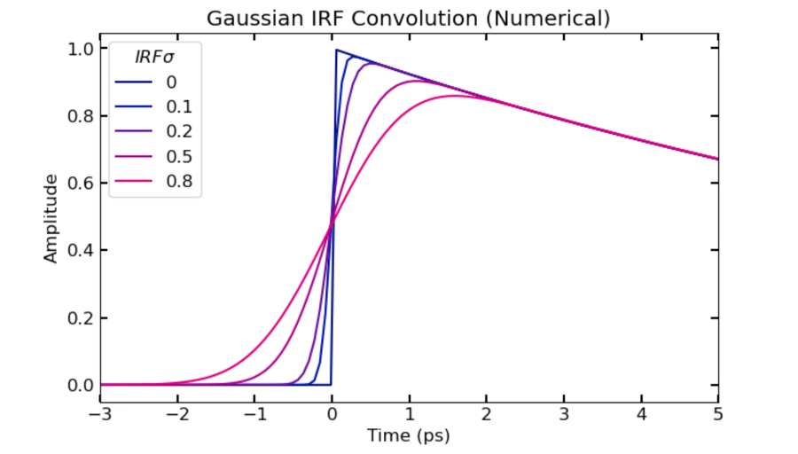
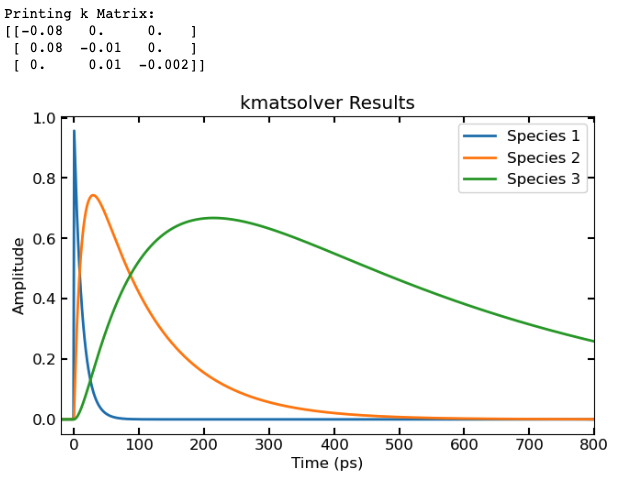
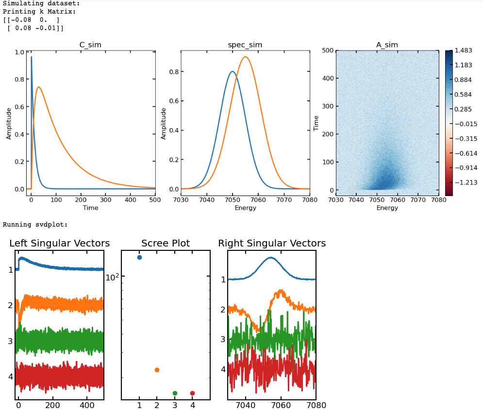
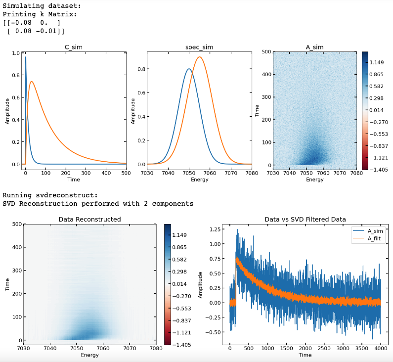
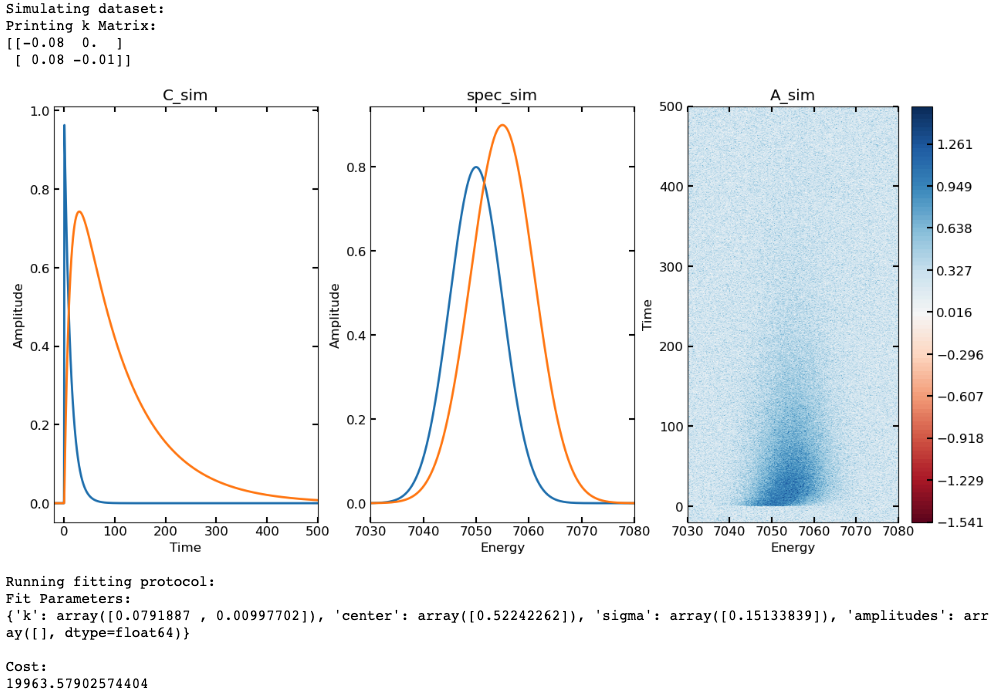
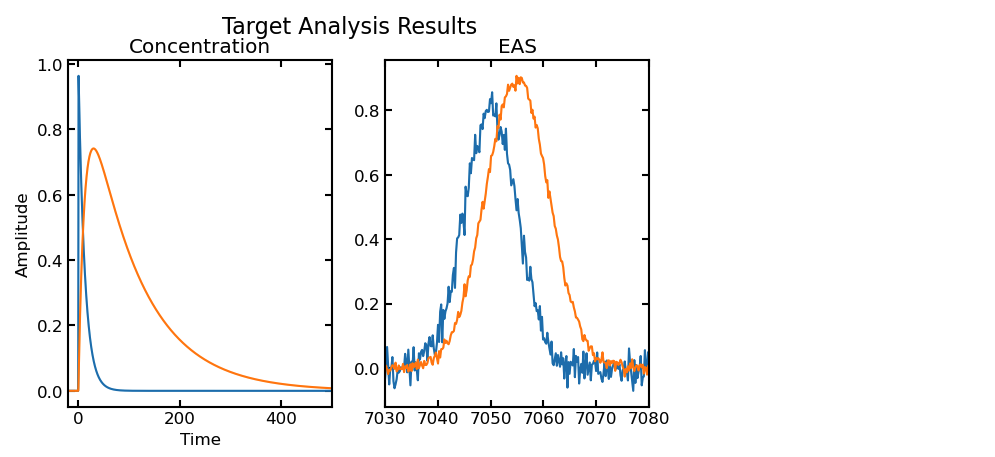

# README #

# XSpect

## Resources

https://bitbucket.org/lclsbioin/xspect/downloads/Spectroscopy_Code.pptx

Post processing module notes:
	https://docs.google.com/document/d/1ZHLMMExlau5z6l_AUbby3waSofyO33W6LL-rySKJC1I/edit

## Installation

*In progress*

## Getting Started

*In progress*

## Post Processing 
Draft by Ryan Ribson

### FXN: irfconv
- Performs numerical convolution between heaviside exponential function and gaussian IRF (gaussian area normalized to 1)
- Inputs:
    - x = x axis (time)
    - k = list or array of exponential rate constants (can have more than one)
    - center = center position of gaussian IRF (will define "time zero")
    - sigma = standard deviation of gaussian IRF
    - amp = amplitude for scaling the function (optional, default will be 1)
- Outputs:
    - The function gives a 2D array back: the first dimension will be that of the provided x grid (time), the second dimension will be \# of k values given; i.e. a matrix where each column is a convolved monoexponential function with rate constant k\[i\]
- Function accepts an array of x axis values along which it returns the convolved function
    - From these values, it generates a new array of linearly spaced x values along which to perform the convolution
        - I increase the maximum time over which the convolution is evaluated beyond the original x axis to avoid numerical truncation effects (sometimes seen at the end of the convolution)
        - I also increase the number of steps along the x axis by a factor of 10: if the time binning is too coarse (say you have time bins of 200 fs, but are trying to describe a gaussian IRF with sigma = 100 fs), the normalization will not work correctly (even just testing numerical integration of the normalized gaussian function, you approach an area value of 1 only once you have sufficient sampling along the x axis)
            - From a data perspective, having time binning sufficiently larger than your IRF width kind of nullifies the effect of the IRF in the first place, but from a fitting/analysis perspective, fitting functions might steer the IRF sigma to values smaller than your time steps in the absence of constraints, which would cause unexpected swings in amplitudes that can affect your fit; ensuring excess sampling in the convolution grid should help to avoid this problem and maintain reasonable normalization
- The heaviside exponential function and normalized gaussian are evaluated over the convolution x grid and then numerically convolved using scipy.signal.fftconvolve
- If two vectors of length m and length n are convolved, the resulting convolution vector will be of length m+n-1, so we need to effectively extract the portion of the convolution containing our signal and then interpolate that portion back onto our original time axis
    - Want to test how this works with non-linearly binned input time (x axis) values
- Example code to visualize effect of varying sigma on shape of function near time zero:
 
```python
import numpy as np
import matplotlib.pyplot as plt
import colorcet.plotting as cc
import XSpect.XSpect_PostProcessing
```

```python
pana = XSpect.XSpect_PostProcessing.post_analysis()
k1 = [0.08] ## rate constant (ps^-1^)
irf_t0 = 0 ## time zero
t = np.linspace(-20, 100, 1921) ## time vector (in ps)
irfsig_list = [0, 0.1, 0.2, 0.5, 0.8] ## IRF sigma values
kpl = plt.cm.get_cmap('cet_bmy', len(irfsig_list)*2)
bmy = kpl(range(10))
```
 
```python 
for i in range(len(irfsig_list)):
    plt.plot(t, pana.**irfconv**(t, k1, irf_t0, irfsig_list[i]), color = bmy[i,:])
```

```python 
plt.xlim([-3, 5])
plt.legend(irfsig_list, title = r'$IRF sigma$')
plt.xlabel('Time (ps)')
plt.ylabel('Amplitude')
plt.title('Gaussian IRF Convolution (Numerical)')
plt.show()
```


### FXN: irfconv_ana
- Evaluates analytical expression for the convolution of exponential and gaussian functions
- Inputs:
    - x = array of x values (time)
    - k = list or array of exponential rate constants
    - center = time zero
    - sigma = gaussian IRF standard deviation
    - amp = amplitudes for scaling
- Outputs:
    - The function gives a 2D array back: the first dimension will be that of the provided x grid (time), the second dimension will be # of k values given; i.e. a matrix where each column is a convolved monoexponential function with rate constant k[i]
- Analytical expression:
$$ 
I(t)\  = \ \frac{A}{2} \cdot exp\lbrack - k(t - t_{0})\rbrack \cdot exp\lbrack 0.5 \ast {(k\sigma)}^{2}\rbrack \cdot (1 + erf\lbrack\frac{t - t_{0} - k\sigma^{2}}{\sigma}\rbrack)
$$
    - A = amplitude
    - k = exponential rate constant
    - t~0~ = "time zero"
    - 𝝈 = gaussian IRF standard deviation/width parameter
    - erf is the error function
- I have the code return the heaviside exponential function if 𝝈 = 0 is provided with time zero shifted to value given by "center"
- Example code to visualize effect of varying sigma on shape of function near time zero (and check that it is consistent with numerical results):

```python
import numpy as np
import matplotlib.pyplot as plt
import colorcet.plotting as cc
import XSpect.XSpect_PostProcessing
```

```python
k1 = [0.08]
irf_t0 = 0
t = np.linspace(-20, 100, 1921)
irfsig_list = [0, 0.1, 0.2, 0.5, 0.8]
kpl = plt.cm.get_cmap('cet_bmy', len(irfsig_list)*2)
bmy = kpl(range(10))
pana = XSpect.XSpect_PostProcessing.post_analysis()
```

```python
for i in range(len(irfsig_list)):
    plt.plot(t, pana.**irfconv_ana**(t, k1, irf_t0, irfsig_list[i]), color = bmy[i,:])
```

```python
plt.xlim([-3, 5])
plt.legend(irfsig_list, title = r'$IRF sigma$')
plt.xlabel('Time (ps)')
plt.ylabel('Amplitude')
plt.title('Gaussian IRF Convolution (Analytical)')
plt.show()
```


### **FXN: kmatsolver**
- Function solves a system of rate equations purely composed of unimolecular (first-order) steps; in these cases, the analytical solution exists and can be found using the eigenvectors/values of the rate constant (k) matrix; building block of global/target kinetic analysis fitting
- Inputs:
    - kmatrix = function mapping k values to an np.array modeling the desired k matrix
    - x = array of x values (time)
    - k = list or array of exponential rate constants
    - X0 = initial conditions (which species has what population at t=0, given as a list or array)
    - center = time zero
    - sigma = gaussian IRF standard deviation
    - irf_option = 'numerical' (default), 'analytical', or 'none' determines which function to evaluate exponentials with (irfconv, irfconv_ana, and expfunc_heaviside respectively)
    - printopt = True (default), prints k matrix (when calling this function iteratively, say in a fitting algorithm, I set this to False)
- Outputs:
    - The function gives a 2D array back: each i<sup>th</sup> column represents the concentration profile of the i<sup>th</sup> species in the kinetic model evaluated over the given x values
- Example code solving a sequential system of kinetic equations:
$$
(A \dashrightarrow B \dashrightarrow C \dashrightarrow decays)
$$

```python
import numpy as np
import matplotlib.pyplot as plt
import colorcet.plotting as cc
import XSpect.XSpect_PostProcessing
```

```python
pana = XSpect.XSpect_PostProcessing.post_analysis()
```

```python
k1 = [0.08, 0.01, 0.002] ## rate constants
irf_c = 0 ## time zero
irf_sig = 0.2 ## IRF std dev (ps)
```

```python
t = np.linspace(-20, 800, 1641) # time (ps)
```

```python
X0 = [1, 0, 0] # initial conditions, at time zero, 1st species is at full population and 2nd and 3rd have no population
```

```python
Km = lambda x: np.array([(-x[0], 0, 0), (x[0], -x[1], 0), (0, x[1], -x[2])]) ## K matrix as a lambda fxn, in kmatsolver will take k list as an input and generate the appropriate K matrix
```

```python
C = pana.**kmatsolver**(Km, t, k1, X0, irf_c, irf_sig)
plt.plot(t, C, linewidth = 2)
plt.xlabel('Time (ps)')
plt.ylabel('Amplitude')
plt.xlim([min(t), max(t)])
plt.legend(['Species 1', 'Species 2', 'Species 3'])
plt.title('kmatsolver Results')
plt.show()
``` 

 
- ### **FXN: svdplot**
    - Performs singular value decomposition (SVD) and plots user defined number of left singular vectors, singular values, right singular vectors
    - Inputs:
        - xval = x axis
        - yval = y axis
        - data = 2D data set to perform SVD on
        - ncomp = number of components to plot
    - Outputs:
        - Plots ncomp left and right singular values and scree plot of
            singular values
    - Example code using svdplot, we will simulate a dataset using two spectra with a sequential kinetic model and added noise then plot the first 4 components of the SVD (we should only expect 2 with significant singular values and structure in the singular vectors)

```python
import matplotlib.pyplot as plt
import colorcet.plotting as cc
import XSpect.XSpect_PostProcessing
```

```python
pana = XSpect.XSpect_PostProcessing.post_analysis()
```

```python
## let\'s simulate some data first to do SVD on
print(\'Simulating dataset:\')
```

```python
## first we\'ll simulate our C(t) matrix (C_sim)
t = np.linspace(-20, 500, 4000)
k_sim = [0.08, 0.01]
irf_t0 = 0.5
irf_sig = 0.15
X0_sim = [1, 0]
Km = lambda x:np.array([(-x[0], 0), (x[0], -x[1])])
C_sim = pana.kmatsolver(Km, t, k_sim, X0_sim, irf_t0, irf_sig)
```

```python
## then will simulate some gaussian "spectra" (spec_sim)
energy = np.linspace(7030, 7080, (7080-7030)*5)
spec_x = [7050, 7055]
spec_sigma = [5, 6, 4]
spec_amp = [0.8, 0.9, 0.85]
spec_sim = np.empty([len(energy), len(spec_x)])
for i in range(len(spec_x)):
spec_sim[:,i] = spec_amp[i]*pana.gaussfunc(energy, spec_x[i],
spec_sigma[i])
```

```python
## calculate full data matrix (A_sim) and add noise
A = C_sim@np.transpose(spec_sim)
noise = np.random.normal(loc = 0, scale = 0.2, size = (len(t),
len(energy)))
A_sim = A + noise
```

```python
## Plot simulated data (C_sim(t), spec_sim(energy), A_sim(t, energy))
plotmax = np.max(np.abs(A_sim))
contlevels = np.linspace(-plotmax, plotmax, 100)
fig, ax = plt.subplots(ncols = 3, nrows = 1, figsize = (15, 5))
```

```python
p1 = ax[0].plot(t, C_sim, linewidth = 2)
ax[0].set_xlabel('Time')
ax[0].set_ylabel('Amplitude')
ax[0].set_xlim([min(t), max(t)])
ax[0].set_title('C_sim')
```

```python
p2 = ax[1].plot(energy, spec_sim, linewidth = 2)
ax[1].set_xlabel('Energy')
ax[1].set_ylabel('Amplitude')
ax[1].set_xlim([min(energy), max(energy)])
ax[1].set_title('spec_sim')
```

```python
p3 = ax[2].contourf(energy, t, A_sim, contlevels, cmap = 'RdBu')
ax[2].set_xlabel('Energy')
ax[2].set_ylabel('Time')
ax[2].set_title('A_sim')
cb = fig.colorbar(p3, ax = ax[2])
```

```python
plt.show()
print('Running svdplot:')
ncomp = 4
pana.**svdplot**(t, energy, A_sim, ncomp)
```


- ### **FXN: svdreconstruct**
    - Performs SVD reconstruction (filtering) on data using the first n components of the SVD
    - Inputs:
        - data = data set to perform SVD and SVD filtering on
        - ncomp = number of components to use to reconstruct the dataset from the SVD
    - Outputs:
        - A_filt = 2D array containing the SVD reconstructed dataset
    - Example code using SVD reconstruction for filtering out noise:
    
 
```python
import numpy as np
import matplotlib.pyplot as plt
import colorcet.plotting as cc
import XSpect.XSpect_PostProcessing
```

```python
pana = XSpect.XSpect_PostProcessing.post_analysis()
```

```python
## let's simulate some data first to do SVD on
print('Simulating dataset:')
```

```python
## first we'll simulate our C(t) matrix (C_sim)
t = np.linspace(-20, 500, 4000)
k_sim = [0.08, 0.01]
irf_t0 = 0.5
irf_sig = 0.15
X0_sim = [1, 0]
Km = lambda x:np.array([(-x[0], 0), (x[0], -x[1])])
C_sim = pana.kmatsolver(Km, t, k_sim, X0_sim, irf_t0, irf_sig)
```

```python
## then will simulate some gaussian "spectra" (spec_sim)
energy = np.linspace(7030, 7080, (7080-7030)\*5)
spec_x = [7050, 7055]
spec_sigma = [5, 6, 4]
spec_amp = [0.8, 0.9, 0.85]
spec_sim = np.empty([len(energy), len(spec_x)])
for i in range(len(spec_x)):
spec_sim[:,i] = spec_amp[i]*pana.gaussfunc(energy, spec_x[i],
spec_sigma[i])
```

```python
## calculate full data matrix (A_sim) and add noise
A = C_sim@np.transpose(spec_sim)
noise = np.random.normal(loc = 0, scale = 0.2, size = (len(t),
len(energy)))
A_sim = A + noise
```

```python
## Plot simulated data (C_sim(t), spec_sim(energy), A_sim(t, energy))
plotmax = np.max(np.abs(A_sim))
contlevels = np.linspace(-plotmax, plotmax, 100)
fig, ax = plt.subplots(ncols = 3, nrows = 1, figsize = (15, 5))
```

```python
p1 = ax[0].plot(t, C_sim, linewidth = 2)
ax[0].set_xlabel('Time')
ax[0].set_ylabel('Amplitude')
ax[0].set_xlim([min(t), max(t)])
ax[0].set_title('C_sim')
```

```python
p2 = ax[1].plot(energy, spec_sim, linewidth = 2)
ax[1].set_xlabel('Energy')
ax[1].set_ylabel('Amplitude')
ax[1].set_xlim([min(energy), max(energy)])
ax[1].set_title('spec_sim')
```

```python
p3 = ax[2].contourf(energy, t, A_sim, contlevels, cmap = 'RdBu')
ax[2].set_xlabel('Energy')
ax[2].set_ylabel('Time')
ax[2].set_title('A_sim')
cb = fig.colorbar(p3, ax = ax[2])
plt.show()
```

```python
print('Running svdreconstruct:')
ncomp = 2
A_filt = pana.**svdreconstruct**(A_sim, ncomp)
```

```python
fig, ax = plt.subplots(ncols = 2, nrows = 1, figsize = (15,5))
p1 = ax[0].contourf(energy, t, A_filt, contlevels, cmap = 'RdBu')
ax[0].set_xlabel('Energy')
ax[0].set_ylabel('Time')
ax[0].set_title('Data Reconstructed')
cb = fig.colorbar(p1, ax = ax[0])
```

```python
index_cut = np.argmin(np.abs(energy - 7050))
ax[1].plot(A_sim[:, index_cut])
ax[1].plot(A_filt[:, index_cut])
ax[1].set_xlabel('Time')
ax[1].set_ylabel('Amplitude')
ax[1].set_title('Data vs SVD Filtered Data')
ax[1].legend(['A_sim', 'A_filt'])
plt.show()
```



- ### **FXN: varproj**
    - Performs variable projection using a kinetic model and a provided data set; building block of global/target kinetic analysis fitting
    - Inputs:
        - kmatrix = function mapping k values to an np.array modeling the desired k matrix
        - x = array of x values (time)
        - k = list or array of exponential rate constants
        - X0 = initial conditions (which species has what population at t=0, given as a list or array)
        - center = time zero
        - sigma = gaussian IRF standard deviation
        - data = experimental data on which you are performing variable projection
    - Outputs:
        - C = matrix of concentration column vectors
        - E = matrix of decay/evolution/species associated spectra (projected from data)
        - SimA = simulated data matrix using kinetic model and variable projection
            - We really only need SimA to calculate residuals for a fitting algorithm, but getting C and E as outputs is useful once we want to visualize the final results of the fit
    - Workflow:
        - In variable projection method we assume a bilinear relationship between time and energy variables (they are separable):
$$
A(t,\lambda)\  = \ C(t)E^{T}(\lambda)
$$
            - Matrix form of Beer-Lambert Law where $C(t)$ is a matrix of column vectors containing time-dependent concentrations of a given species and $E^{T}(\lambda)$ is a matrix of row vectors containing energy-dependent spectra of a given species
                - **Note:** the way that I have defined this means that by default the expected dimensions of the data matrix A will be 1st dimension (rows) = time and 2nd dimension (columns) = energy
        - We generally choose one set of variables to parameterize for fitting (often time, i.e. kinetic modelling). The other set of variables are taken as linearly conditional on the parameterized set
            - The spectral vectors in $E$ are projected from the experimental data using the calculated concentration vectors $C$; $pinv()$ is the Moore-Penrose pseudo inverse
$$
pinv(C)A\  = \ pinv(C)CE^{T}
$$
$$
E^{T} = \ pinv(C)A
$$
        - The simulated data set can then be constructed as follows:
$$
A_{\text{sim}} = C_{\text{sim}}E^{T} = C_{\text{sim}}pinv(C_{\text{sim}})A_{\exp}
$$
            - This can then be used to calculate residuals in a global/target kinetic analysis objective function
- ### **FXN: targetobjective**
    - Target analysis objective function, takes parameter vector as
        primary input, calculates simulated data using parameters
        defined in theta, and returns residuals
    - Inputs:
        - theta = vector containing parameters to be optimized in fit
        - x = array of x values (time)
        - kmatrix = function mapping k values to an np.array modeling
            the desired k matrix
        - x = array of x values (time)
        - X0 = initial conditions (which species has what population
            at t=0, given as a list or array)
        - theta_parser = dictionary of parameters generated from
            function "parse_theta", tells us how to read theta and map
            to function inputs
        - data = experimental data to be fit
    - Outputs:
        - A 1D array containing residuals of the experimental data
            minus data simulated via the function "varproj"
    - Workflow:
        - The variables in the vector theta are sorted into a new
            dictionary based on the structure of theta_parser
        - These variables are then passed to the varproj function to
            calculate simulated data matrix given the kinetic model
            supplied
        - The residuals are calculated and then sorted into a 1D array
- ### **FXN: targetanalysis_run**
    - Running target kinetic analysis using the
        scipy.optimize.least_squares function
    - Inputs:
        - data = experimental data to fit
        - x = array of x values (time)
        - kmatrix = function mapping k values to an np.array modeling
            the desired k matrix
        - k_in = list or array of initial guess exponential rate
            constants
        - center_in = initial guess time zero
        - sigma_in = initial guess gaussian IRF standard deviation
        - X0_in = initial conditions (which species has what
            population at t=0, given as a list or array) for kinetic
            model
        - y = array of y values, energy (optional)
        - bounds_dict = dictionary of parameter constraints (optional,
            see below)
    - Outputs:
        - res_lsq = object containing the fit results from
            scipy.optimize.least_squares run
        - C_fit = concentration matrix calculated using fitted
            parameters
        - E_fit = decay/evolution/species associated spectra
            calculated using fitted parameters
            - Additional outputs include:
                - Printing dictionary containing fitted parameters
                - Printing final cost function from least squares at
                    optimized position (taken from res_lsq.cost, seems
                    to be printing residual sum of squares divided
                    by 2)
                - Plotting concentration profiles and
                    decay/evolution/species associated spectra of each
                    component
    - Workflow:
        - The support functions parse_theta are used to package k_in,
            center_in, and sigma_in into a dictionary format that can
            be used to map the variables to (construct_theta) and from
            (read_theta) the parameter vector (theta) that will be
            provided to scipy.optimize.least_squares
        - Parameter constraints are set if an appropriate bound
            dictionary is provided, otherwise default constraints are
            applied
        - The fitting algorithm is run using the target objective
            function, the generated parameter vector (theta), and the
            other inputs necessary for target objective function
        - The fit parameters are read out into a dictionary that is
            printed
        - The final cost of the least squares function is printed
        - The fitted concentration profiles and
            decay/evolution/species associated spectra are plotted
    - Some quirks:
        - In the exponential functions, I take the absolute value of
            the given k values to ensure exponential decay, i.e.
            - fxn = a\*exp(-kt)
                - For exponential decay, k will always be positive
            - I think this is the most likely case we will encounter
                in chemical kinetics, if we need a more general
                approach we can change this
            - This means that for fitting, there are symmetries in the
                error surface around zero for the rate constant
                parameters
                - Using Levenberg-Marquardt or trust region reflective
                    implementations in scipy.optimize.least_squares,
                    this usually doesn't pose too much of a problem in
                    the sense that the correct value of rate constant
                    is usually attained, but not the necessarily the
                    sign
        - The Levenberg-Marquardt implementation in
            scipy.optimize.least_squares does not support parameter
            constraints, in order to include this, I use the default
            trust region reflective method
            - Users can supply a "bound dictionary" to define the
                lower and upper bounds for parameters; I've
                arbitrarily had this take the form below:
- **Example of a bound dictionary (bd) that targetanalysis_run can accept; the overarching dictionary contains two lower level dictionaries, one for lower bounds ('lb') and one for upper bounds ('ub'); the lower/upper bounds for every parameter is then given in list form under the appropriate key

bd = {'lb': {'k': [0, 0], 'center': [-10], 'sigma': [0]}, 
'ub': {'k': [np.inf, np.inf], 'center': [10], 'sigma':
[1]}}

- Given the considerations above, I provide a set of default bounds
    - For every rate constant guess provided, a set of [0 to np.inf] bounds are given, indicating that the k will always be positive (and does away with the symmetry around zero problem)
    - For irf center (t0) parameter, the default is unconstrained [-np.inf to np.inf]
    - For irf sigma (linewidth) parameter, the default is constrained [0 to np.inf]
- Currently these are the only two options for targetanalysis_run -
    the default constraints and user supplied constraints, can add
    option for fully unconstrained though this could lead to some
    issues
- Currently the only way to "fix" parameters in the fit would be to
    use the bound dictionary format provided above and set the lower
    and upper bound for a given parameter to be equal to the desired
    "fixed" value, may be sufficient, will look into options
- I do not have an implementation yet for calculating standard errors
    from the fit (though the output of scipy.optimize.least_squares
    returns a jacobian, which can be used to estimate the Hessian and
    by extension the covariance matrix of the parameters)\... will
    work on
- Example where a 2D data set in time and energy is simulated and then the target analysis fitting protocol is run (using a bound dictionary):

```python
import numpy as np
import matplotlib.pyplot as plt
import colorcet.plotting as cc
import XSpect.XSpect_PostProcessing
pana = XSpect.XSpect_PostProcessing.post_analysis()
```

```python
## let's simulate some data to test the fitting on first
print('Simulating dataset:')
```
      
```python
## first we'll simulate our C(t) matrix (C_sim)
t = np.linspace(-20, 500, 4000)
k_sim = [0.08, 0.01]
irf_t0 = 0.5
irf_sig = 0.15
X0_sim = [1, 0]
Km = lambda x:np.array([(-x[0], 0), (x[0], -x[1])])
C_sim = pana.kmatsolver(Km, t, k_sim, X0_sim, irf_t0, irf_sig)
```

```python
## then will simulate some gaussian "spectra" (spec_sim)
energy = np.linspace(7030, 7080, (7080-7030)*5)
spec_x = [7050, 7055]
spec_sigma = [5, 6, 4]
spec_amp = [0.8, 0.9, 0.85]
spec_sim = np.empty([len(energy), len(spec_x)])
for i in range(len(spec_x)):
spec_sim[:,i] = spec_amp[i]*pana.gaussfunc(energy, spec_x[i],
spec_sigma[i])
```

```python
## calculate full data matrix (A_sim) and add noise
A = C_sim@np.transpose(spec_sim)
noise = np.random.normal(loc = 0, scale = 0.2, size = (len(t),
len(energy)))
A_sim = A + noise
```

```python
## Plot simulated data (C_sim(t), spec_sim(energy), A_sim(t, energy))
plotmax = np.max(np.abs(A_sim))
contlevels = np.linspace(-plotmax, plotmax, 100)
fig, ax = plt.subplots(ncols = 3, nrows = 1, figsize = (15, 7))
p1 = ax[0].plot(t, C_sim, linewidth = 2)
ax[0].set_xlabel('Time')
ax[0].set_ylabel('Amplitude')
ax[0].set_xlim([min(t), max(t)])
ax[0].set_title('C_sim')
p2 = ax[1].plot(energy, spec_sim, linewidth = 2)
ax[1].set_xlabel('Energy')
ax[1].set_ylabel('Amplitude')
ax[1].set_xlim([min(energy), max(energy)])
ax[1].set_title('spec_sim')
p3 = ax[2].contourf(energy, t, A_sim, contlevels, cmap = 'RdBu')
ax[2].set_xlabel('Energy')
ax[2].set_ylabel('Time')
ax[2].set_title('A_sim')
cb = fig.colorbar(p3, ax = ax[2])
plt.show()
```

```python               
## now that we have a data set to fit, we'll set up a guess
## this includes starting points for fit parameters (k and irf)
## as well as a kinetic model to use (the k matrix defined in K_guess)
```

```python
## and run the fitting procedure
print('Running fitting protocol:')
k_guess = [0.2, 0.001]
irf_t0_guess = [0]
irf_sigma_guess = [1]
K_guess = lambda x:np.array([(-x[0], 0), (x[0], -x[1])])
X0_guess = [1, 0]
bd = {'lb': {'k': [0, 0], 'center': [-10], 'sigma': [0]}, 'ub': {'k': [np.inf, np.inf], 'center': [10],
'sigma': [1]}}
fit, C_fit, spec_fit = pana.**targetanalysis_run**(A_sim, t, K_guess,
k_guess, irf_t0_guess, irf_sigma_guess, X0_guess, y = energy,
bounds_dict = bd)
```




	
